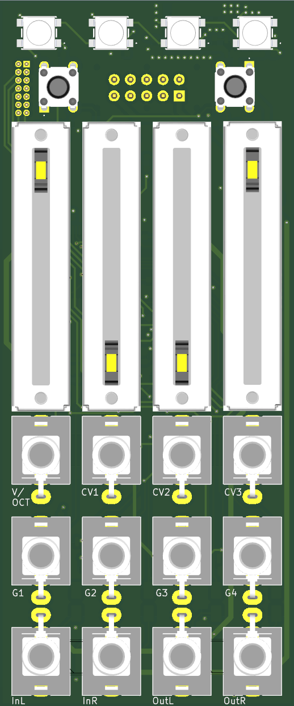
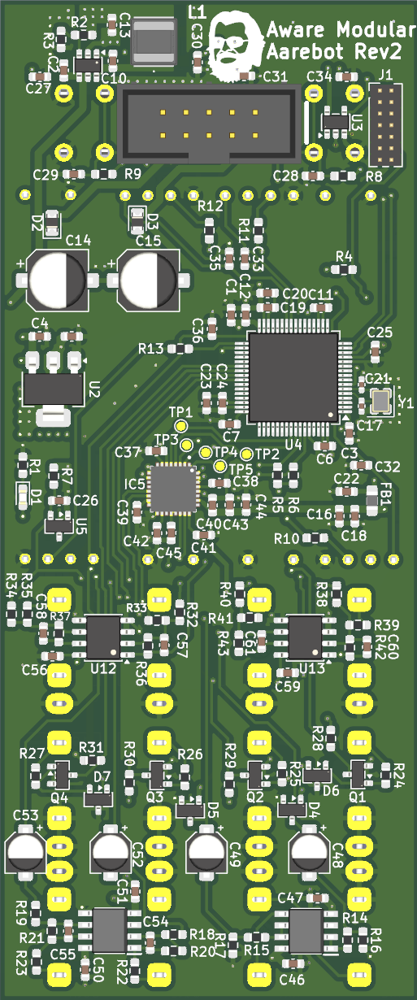

# Aarebot
Aarebot is a Eurorack Modular Synthesizer Module based on the STM32 H7 platform.

<p align="center">
  
  
</p>

## Overview
- **Hardware**: KiCad project with schematic and PCB design.  
- **Firmware**: STM32CubeMX used for pin assignment and hardware peripheral configuration.  

## Directory Structure
- [**/hardware/aware01_h7_rev2_0**](/hardware/aware01_h7_rev2_0): Contains the KiCad project files for schematic and PCB design.  
- [**/hardware/simulation**](/hardware/simulation): Contains spice simulations for analog in/out stages.  
- [**/firmware**](/firmware): STM32CubeMX project files for hardware configuration.  

## Building the project

1. Prepare cmake build environment:

```sh
cmake -S . -B build/Debug \
  -G Ninja \
  -DCMAKE_TOOLCHAIN_FILE=./cmake/gcc-arm-none-eabi.cmake
```

2. build with cmake
