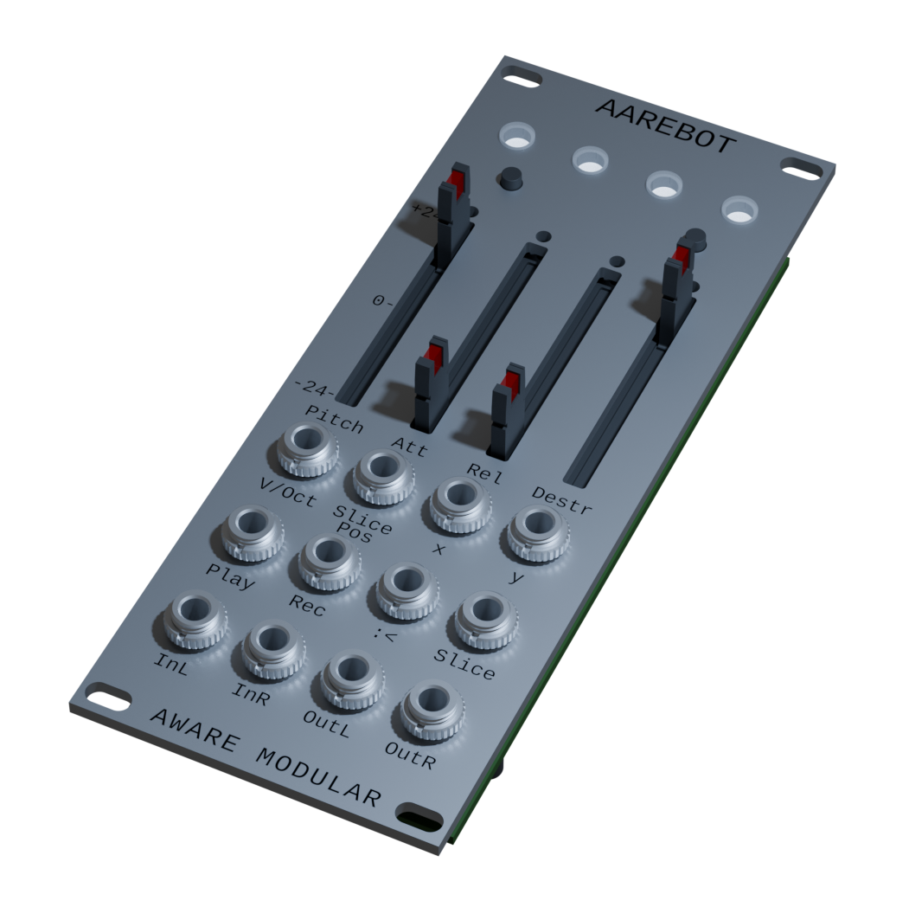
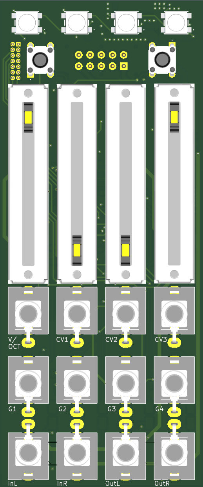
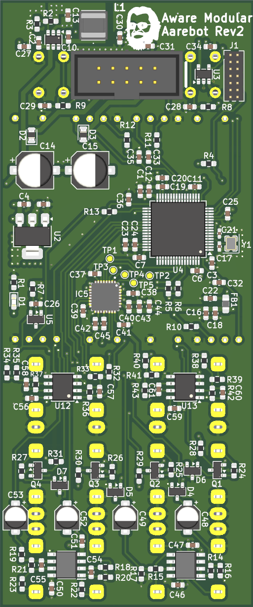

# Aarebot

> **Dynamic realtime stereo sampler for Eurorack modular synthesizer - STM32H7**

---

Aarebot is a dynamic realtime sampler built as a Eurorack module. At its core is a stereo tape-style engine with a hot-swapping record/playback buffer - this enables to record and play simultaneously.
Slicing markers can be added on the fly, and processing through an onboard effects chain.

Samplerate decimation trades fidelity for buffer length.
A Schroeder reverb implementation reaching from spacious room to sharp metallic resonance ringing depending on the XY effect mapping.

More DSP FX and taillred XY mapping is on the way and will turn Aarebot into an IDM LOFI crunch machine.

---
<p align="center">



</p>


## Features

### Audio Engine
- Stereo hot-swap record/playback buffer
- Realtime sample slicing with manual slice marker placement
- Hermite interpolation for smooth pitch shifting (±24 semitones)
- V/Oct pitch tracking (−1.5 V to +5 V)
- Samplerate decimation for extended recording time and lo-fi texture
- Nonlinear exciter
- Schroeder reverb with prime-length delay lines and scalable room size

### Control
| Interface | Function |
|-----------|----------|
| Pot 1 | Base pitch (±24 semitones) |
| Pot 2 | Envelope attack |
| Pot 3 | Envelope decay / release |
| Pot 4 | Recording decimation |
| V/Oct | Pitch CV input |
| CV 2 | XY effect plane - X axis |
| CV 3 | XY effect plane - Y axis |
| Gate 1 | Record |
| Gate 2 | Play |
| Gate 3 | *(unassigned)* |
| Gate 4 | Set slice marker |

### Hardware
- STM32H7 MCU
- Custom I2C audio codec driver
- 4x WS2812 RGB LEDs for visual feedback
- ADC calibration with 2-point and piecewise CV calibration
- Full KiCad schematic and PCB design
- SPICE simulations for analog input/output stages

---

## Repository Structure

```
├── firmware/                 STM32CubeMX project and C source
|   ├── Aware                 Main firmware implementation
|   └── Src                   CubeMX generated src files
├── hardware/
│   ├── aware01_h7_rev2_0/    KiCad schematic and PCB
│   └── simulation/           SPICE simulations for analog stages
└── docs/
    └── images/
```

---

## Building

Requires `arm-none-eabi-gcc`, `cmake`, and `ninja`.

```sh
# Configure
cmake -S . -B build/Debug \
  -G Ninja \
  -DCMAKE_TOOLCHAIN_FILE=./cmake/gcc-arm-none-eabi.cmake

# Build
cmake --build build/Debug
```

---

## Hardware

Designed in KiCad. The hardware directory contains the full schematic, PCB layout, and SPICE simulations for the analog input and output conditioning stages.

---

## Specifications

### Audio
| Parameter | Value |
|-----------|-------|
| Sample rate | 48 kHz |
| Bit depth | 16-bit |
| Recording buffer | 2.5 s (stereo) |
| End-to-end latency | ~1.9 ms |
| Audio codec | TLV320AIC3204 |

### Hardware
| Parameter | Value |
|-----------|-------|
| MCU | STM32H7A3RITx (Cortex-M7, 280 MHz) |
| Form factor | 10 HP, 3U Eurorack |
| Audio I/O levels | ±5 V |
| CV input range | ±10 V |
| V/Oct range | −1.5 V to +5 V |
| Power (+12V) | ~80 mA idle, ~140 mA peak |
| Power (−12V) | ~20 mA |

---

## License

| Component | License |
|-----------|---------|
| Firmware / software | [GPL-3.0](LICENSE) |
| Hardware (schematics, PCB, SPICE) | [CERN OHL-S v2](LICENSE-CERN-OHL-S) |
| Thesis / documentation | [CC BY 4.0](LICENSE-CC-BY) |
