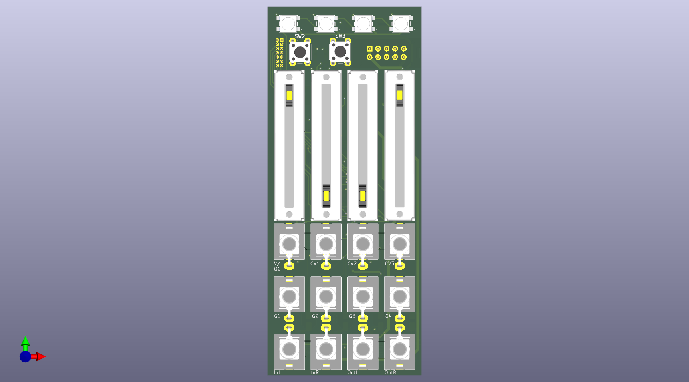
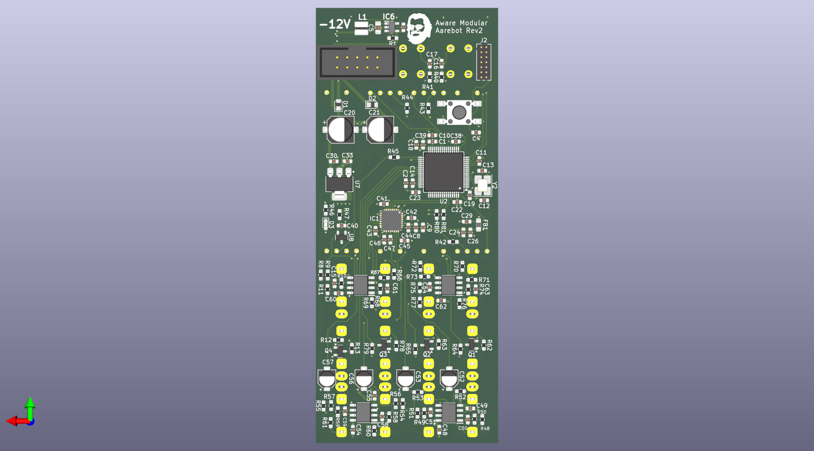

# Aarebot
Aarebot is a Eurorack Modular Synthesizer Module based on the STM32 H7 platform.

  
  

## Overview
- **Hardware**: KiCad project with schematic and PCB design.  
- **Firmware**: STM32CubeMX used for pin assignment and hardware peripheral configuration.  
  > Note: Firmware development is not yet implemented.

## Directory Structure
- [**/hardware/aware01_h7_rev2_0**](/hardware/aware01_h7): Contains the KiCad project files for schematic and PCB design.  
- [**/hardware/simulation**](/hardware/simulation): Contains spice simulations for analog in/out stages.  
- [**/firmware**](/firmware): STM32CubeMX project files for hardware configuration.  