<!-- _paginate: false -->

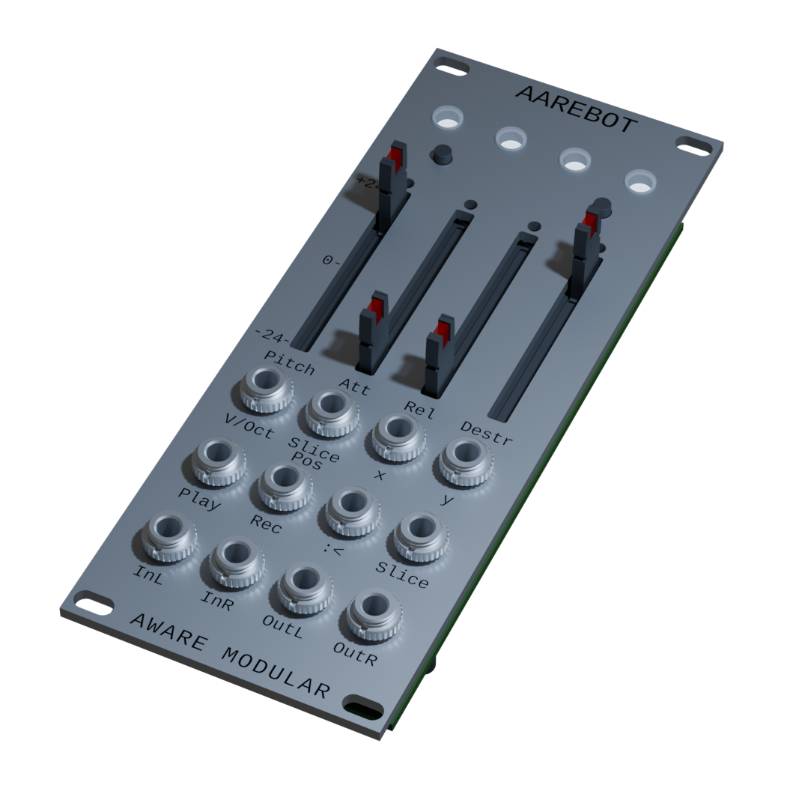

# AAREBOT
### Development of an Embedded DSP Eurorack Synthesizer Module

<br>

**Jonas Lux** &nbsp;·&nbsp; B.Sc. Technische Informatik
Technische Hochschule Köln &nbsp;·&nbsp; April 2026

_**All sources open-licensed:**_
_GPL-3.0 firmware · CERN OHL-S hardware · CC-BY docs_

---

# What is Eurorack?

<div class="container">
<div class="col">

**A modular synthesizer standard**
- Defined by Doepfer in 1996 — now 11,700+ modules from hundreds of makers
- 3U rack height · module width in HP (5.08 mm steps)
- Modules snap into a powered case and connect via 3.5 mm patch cables

**Control Voltage (CV) & Gate**
- Audio and control signals share the same patch points
- Pitch: 1 V/octave standard · Gates: 0–5 V trigger signals
<!-- - Signal flow is entirely user-defined — no fixed routing -->

</div>
<div class="col" style="text-align:center">

<br>
<br>

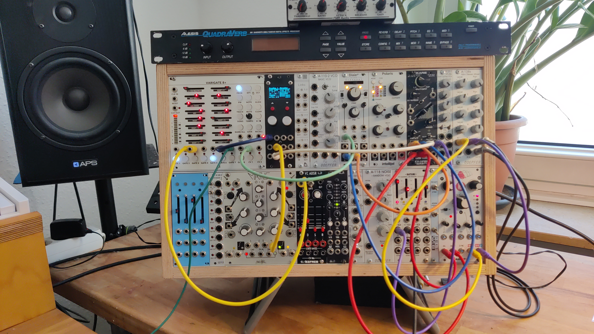

</div>
</div>

---

# Motivation

<div class="container">
<div class="col">

**The problem**
- Commercial DSP modules cost **€150–€500** per unit
- Most are **closed-source** black boxes

</div>
<div class="col">

**The opportunity**
- STM32H7 (Cortex-M7) is capable of real-time DSP
- Growing community interest in open hardware

</div>
</div>

<br>

<div style="text-align:center">

> Can a fully open-source Eurorack DSP module be built on MCU-class hardware — achieving real-time performance suitable for live use?

</div>

---

# System Overview — What is Aarebot?

<div class="container" style="align-items:flex-start">
<div class="col">

A **real-time stereo audio sampler** with DSP effects

**Core features**
- Record stereo audio into RAM · **2.5 s buffer**
- Record while Play
- Variable-pitch playback · **±24 semitones** (fader + V/Oct CV)
- Cyclic looping & reverse playback
- **Schroeder reverb** with XY CV control
- Decimation during record up to **16×** for lo-fi textures

**Interface** · 10 HP · 3U Eurorack
- 4 slide faders · 2 buttons · 4 RGB LEDs
- 9 inputs: stereo audio · V/Oct · 3× CV · 4 gates · stereo output

</div>
<div class="col" style="text-align:center; flex: 0 0 350px">


</div>
</div>

---


<div class="container" style="align-items:center">
<div class="col">

# Hardware Design
MCU · Signal Conditioning · Power

</div>
<div class="col" style="text-align:center">

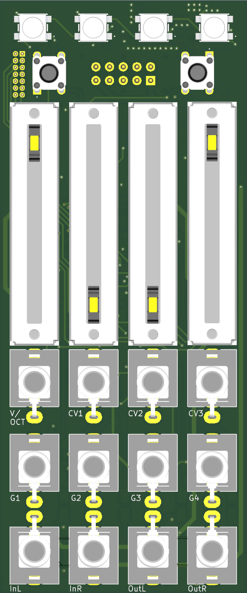
&nbsp;&nbsp;&nbsp;&nbsp;
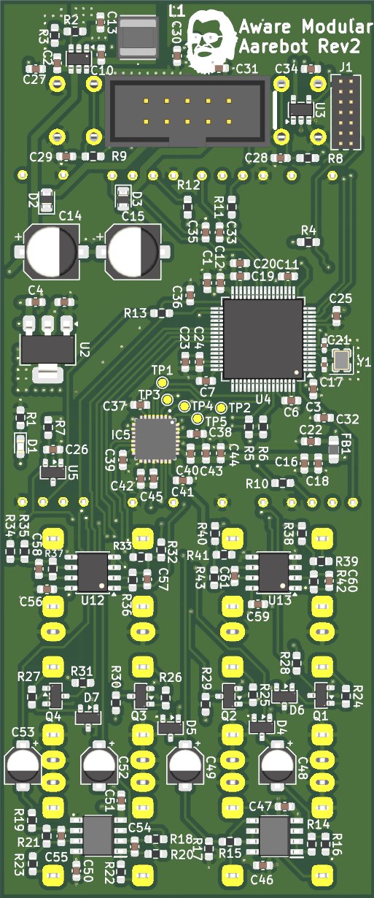

</div>
</div>

---

# Hardware Architecture

<div class="container">
<div class="col">

<br>
<br>

**Microcontroller — STM32H7A3RITx**
- Cortex-M7 @ 280 MHz, hardware FPU
- 2 MB Flash · 1.4 MB SRAM

<br>
<br>
<br>

**Audio Codec — TI TLV320AIC3204**
- 48 kHz · 16-bit stereo I²S
- DMA-driven · circular mode

<!-- **Signal conditioning**
- Audio in/outs: AC-coupled, BAT54S Schottky clamp
- CV in: ±10 V tolerance, op-amp rail guard
- Gate in: ±12 V transistor clamping
- V/Oct: 2-point calibration (C1 @ 1V, C3 @ 3V) -->

</div>
<div class="col">

**Power tree**

<br>
<br>

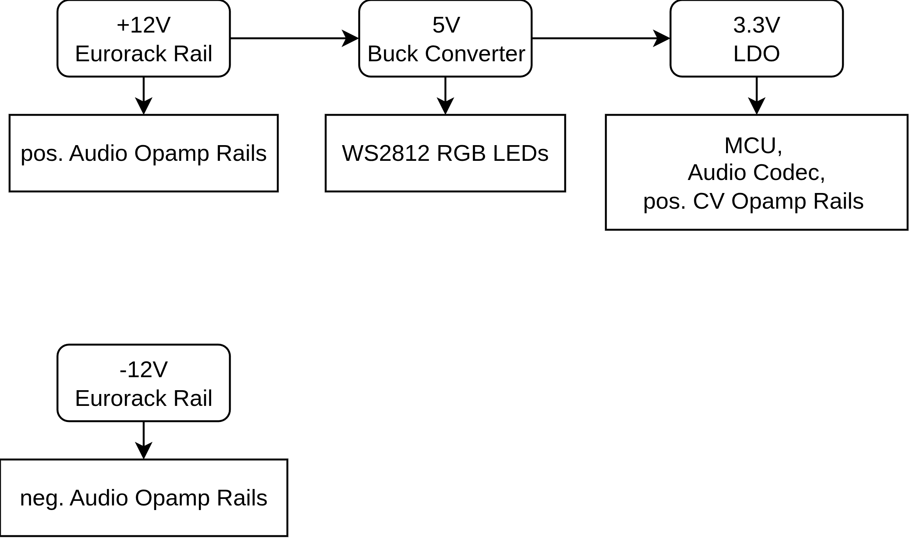

</div>
</div>

---

# Analog Frontend

<div class="container">
<div class="col" style="display:flex; flex-direction:column;">

**Audio Input** — unity-gain buffer + passive divider
- Eurorack 10 V_pp → 0.77 V_pp
- AC coupling: 2.2 µF + 48 kΩ → f_c = 1.5 Hz
- BAT54S Schottky clamp to AVDD / GND

<div style="margin-top:auto">

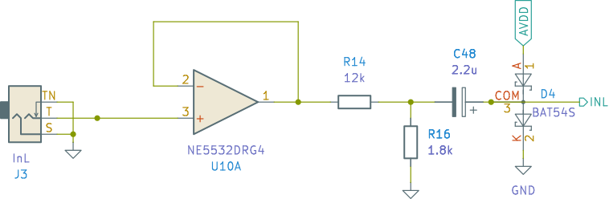

</div>

</div>
<div class="col" style="display:flex; flex-direction:column;">

**Audio Output** — AC-coupled inverting amplifier
- Codec DAC: 1.4 V_pp @ 0.9 V CM → ±4.8 V (9.57 V_pp)
- 10 µF coupling cap removes DC offset · f_c = 2.84 Hz

<div style="margin-top:auto">

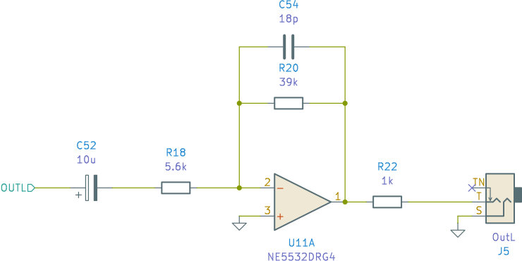

</div>

<!-- **CV Input** — inverting summing amp + −10 V bias
- Maps ±5 V CV → 0–3.3 V ADC range
- V/Oct: −1.5 V … +5 V → 0.2–3.25 V ADC -->

</div>
</div>

---

# Firmware Architecture

FreeRTOS

---

## Firmware: FreeRTOS Task Architecture

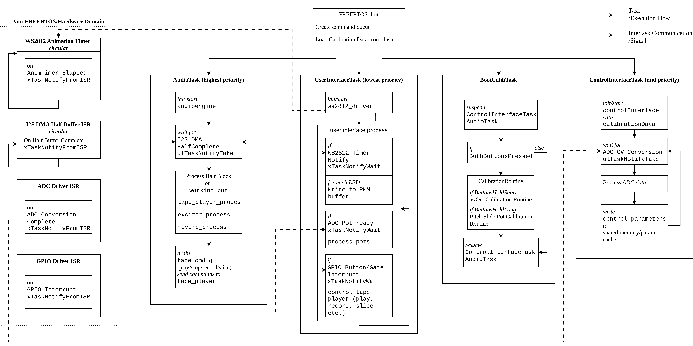

<!-- - **Lock-free parameter cache** — no mutex in the audio path · DMA buffers in **non-cacheable SRAM**
- Control + UI tasks: **0% CPU** during audio · Full DSP chain: **60–66% CPU** @ 48 kHz -->

---

# Focus 1: Tape Player

Ping-Pong Buffer · Crossfading · Phase Accumulation

---

## Tape Player: Buffer Architecture

**Why ping-pong?**
- Record and playback must run simultaneously without pause
- Two buffers: one active for playback, one being recorded into
- On recording complete: **atomic swap** — playback continues uninterrupted from new buffer

**Slice markers**
- Written into buffer metadata during recording
- CV input → sample-accurate jump to any slice


---

## Tape Player: Crossfade System

<div class="container" style="align-items:flex-start">
<div class="col">

**Three scenarios — all click-free**

**1. Trigger from silence** 
→ simple fade-in and fade-out

<br>
<br>

**2. Retrigger during play** 
→ overlap crossfade

<br>
<br>

**3. Cyclic loop wrap** 
→ crossfade at buffer boundary

<!-- - Quarter-sine LUT → constant-power (−3 dB) crossover
- Fade accumulator **decoupled from playhead** → consistent duration at any pitch -->

</div>
<div class="col">

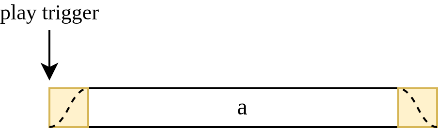

<br>

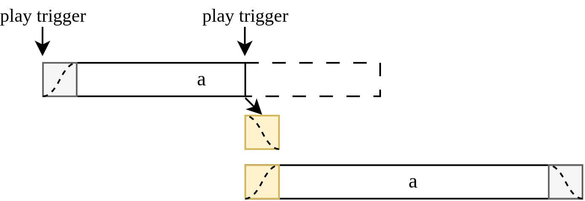

<br>

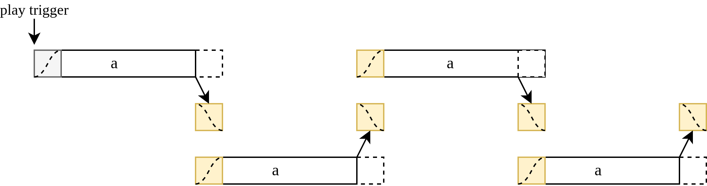

</div>

---

## Q48.16 Phase Accumulator

Tracks the playback position as a fixed-point integer 
integer part = buffer index; fractional part = sub-sample offset for interpolation.

<div class="container">
<div class="col">

**Playhead position as `uint64_t`**

| Bits | Role |
|------|------|
| [63:16] — 48 bits | Integer sample index into buffer |
| [15:0] — 16 bits | Fractional sub-sample offset *t* |

<!-- **Why 48-bit integer part?**
Buffer holds 48 000 × 2.5 s = **120 000 samples** — exceeds 16-bit max (65 535) -->

</div>
<div class="col">

**Extracting index and fraction:**

```c
uint32_t idx  = (uint32_t)(pos >> 16);
float    t    = (pos & 0xFFFF) * (1.0f / 65536.0f);
```

*t* feeds directly into the Hermite interpolator

**Clean architectural boundary:**
- Phase domain → fixed-point (exact, no rounding)
- Audio domain → float (hardware FPU, wide dynamic range)

<!-- All index comparisons and crossfade distances stay in Q.16 units — boundary checks become bit-shifts, no division -->

</div>
</div>

---

# Focus 2: Pitch Interpolation

ZOH · Linear · Cubic Hermite

---

## Pitch Interpolation: Problem & Approach

<div style="width:48%">


Variable-speed playback reads the buffer at **non-integer sample positions** — interpolation is required.

<!-- Variable-speed playback means the playhead advances at a rate that is not an integer multiple of the sample period —
so we land between two recorded samples. 
The actual sample value at that position was never stored, so we have to estimate it from the neighbors. -->

<br>

**Zero-Order Hold (ZOH)**
<!-- ZOH -->
<!-- last sample repeated → staircase waveform
→ strong aliasing, especially at slow speeds -->

<br>

**Linear interpolation**
<!-- Linear Interpolation -->
<!-- Weighted blend of two neighbors
→ smoother, but slope discontinuities remain -->

<br>

**4-Point Cubic Hermite (Catmull-Rom)**
<!-- Cubic Interpolation -->
<!-- C¹-continuous, derivatives from finite differences
→ flat passband, suppressed aliasing -->

</div>

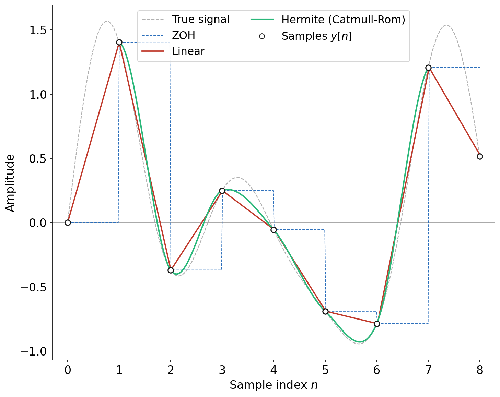

---

## Pitch Interpolation: How Hermite Works

<div style="width:48%">

Fit a cubic polynomial through the known samples **and** match their slopes — using tangents estimated from 4 neighbors:

$$x_{-1},\ x_0,\ x_1,\ x_2$$

$$m_0 = \tfrac{1}{2}(x_1 - x_{-1}), \quad m_1 = \tfrac{1}{2}(x_2 - x_0)$$

Construct cubic from $x_0,\ x_1,\ m_0,\ m_1$ — evaluate at *t* ∈ [0, 1):

$$y(t) = a_3 t^3 + a_2 t^2 + m_0\, t + x_0$$

$a_2,\, a_3$ solved so that $y(1) = x_1$ and $y'(1) = m_1$

→ C¹-continuous, no precomputed derivatives needed.

<!-- 1st order -> linear interpolation -->
<!-- 2nd order -> quadratic interpolation (not used in audio, because asymmetric. Needs 3 samples) -->]
<!-- 2nd order cant match value and slope at both endpoints, therefore cubic (3rd order) interpolation is used. -->
</div>

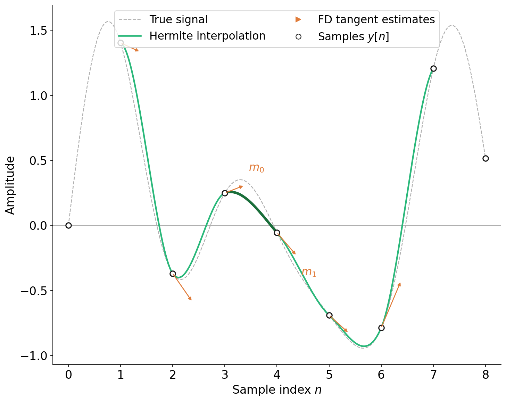

---

## Interpolation Results: FFT Comparison

**100 Hz sawtooth at 7 playback speeds (0.25× – 4.0×)**

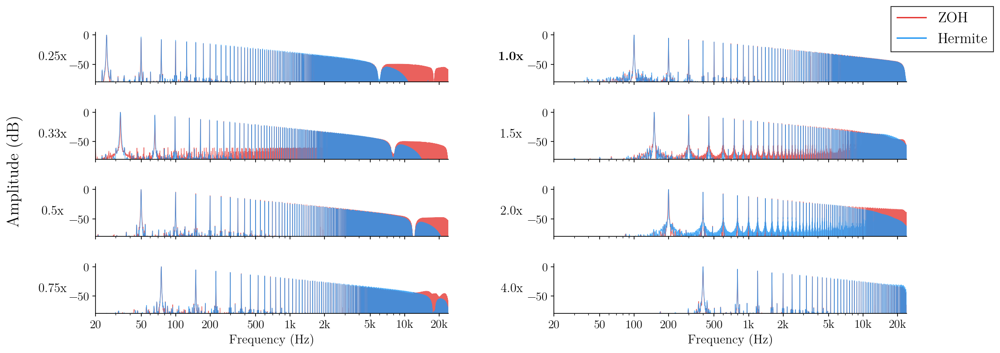

**ZOH** (red) produces strong aliasing "humps" — worst at 0.25× (−2 octaves) · **Hermite** (blue) stays clean across all speeds

---

# Focus 3: Schroeder Reverb

Architecture · Embedded Implementation
<!-- 
  Manfred R. Schroeder — Bell Labs researcher, published 1962:
  First algorithmic reverb using feedback comb + allpass filters
  to produce diffuse, natural-sounding decay without dedicated hardware.
  Still the basis of most algorithmic reverb designs today.
-->
---

<h2 style="position:absolute; top:100px; margin:0">Schroeder Reverb: Architecture</h2>

<div style="width:48%; margin-top:80px">

**Design rationale**
- **4 parallel comb filters** (prime lengths 1427–1613 smp)
<!-- characteristic decay + spectral coloring -->
- **2 series allpass filters**: echo density
- **Lowpass in comb feedback**: HF absorption (simulates real-world materials)
- **Prime-length delay lines**: even modal distribution
- Slight **L/R asymmetry** → stereo decorrelation

**Memory: 61.4 kB** static float allocation

</div>

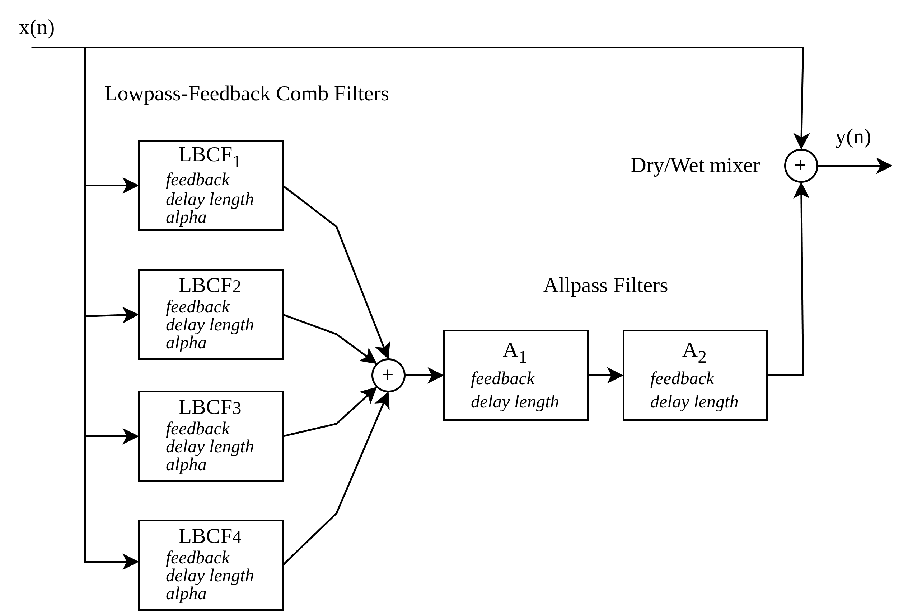

---

<h2 style="position:absolute; top:100px; margin:0">Schroeder Reverb: CV Parameters</h2>

<div style="width:48%; margin-top:80px">


**CV-controllable parameters**

<div style="font-size: 18px;">

| CV Param | DSP Parameter | Effect |
|----------|---------------|--------|
| Dry / Wet | Mixer coefficient | Blend balance |
| Feedback | LBCF and AP _feedback_ | RT60 decay time |
| Room size | LBCF and AP _delay length_ | Scales all delay lengths |
| LP cutoff | LBCF _alpha_ coefficient | HF damping character |


</div>
</div>


---

<!-- Another feature not mentioned detailed in the thesis is the XY-Mapper -->
<!-- Currently only mapped to reverb, but of course multiple DSP-FX parameters may be mapped onto it, to create a multi-FX rack, controlled by only 2 CV inputs -->

## Schroeder Reverb: XY Mapper
**2D CV input → multiple DSP-FX parameters simultaneously**

- Two CV inputs normalized to [−1, 1]
- Each axis drives independent parameters via **piecewise exponential curves**
- Curve exponent shapes the perceptual response per parameter


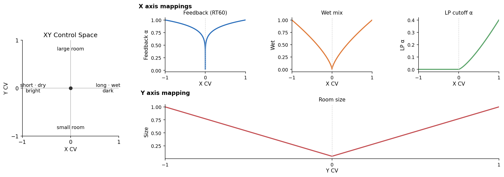


---


# System Verification

Requirements · Latency · CPU

---

## System Verification

<div class="container">
<div class="col">

**End-to-end latency** — requirement: < 5–10 ms

| Metric | Value |
|--------|-------|
| Mean latency | **1.9 ms** |
| Max latency | **2.6 ms** |
| Block size | 128 samples @ 48 kHz = 2.67 ms |

Gate-in → audio-out, measured via oscilloscope.
Well within real-time requirement.

<!-- Mean latency (1.9 ms) < block period (2.67 ms) makes sense:
     latency depends on where in the DMA cycle the gate arrives —
     varies between 0 and ~one block, so max ≈ block period (2.6 ms ≈ 2.67 ms). -->

</div>
<div class="col">

**CPU utilization @ 48 kHz**

| Scenario | CPU |
|----------|-----|
| Tape player + Hermite pitch | ~40% |
| + Schroeder reverb (stereo) | 60–66% |
| Control + UI tasks | ≈ 0% |

Sufficient headroom for additional DSP algorithms.

<!-- Per-stage cost (Ausschlussverfahren — incremental disabling):
  Schroeder reverb:      28–32 %
  Hermite interpolation:  7–9 %
  Fade processing:        5–6 %
  Remaining (tape):      18–21 % -->

</div>
</div>

---

# Known Issues & Future Work

<div class="container">
<div class="col">

**Hardware revisions needed**
- Gate 3 pin misassignment 
(bodge: PC9 → PC6)
- Fader LED pin assignments incorrect
- BAT54S clamp diode mounted inverted
- Audio input LF rolloff: −3 dB @ **37.6 Hz** (designed for 1.8 Hz)

**Firmware limitations**
- DTCMRAM at **98.5%** — near ceiling
- Recording buffer: 2.5 s (constraining for sustained material)

</div>
<div class="col">

**Planned enhancements**


External PSRAM (8 MB)
Granular synthesis 
Synced delay algorithm 
CV-controllable xfade length 
Decimation: division → shift

</div>
</div>

---

<!-- _paginate: false -->

<br><br><br>

<div style="text-align:center">

# Thank you — Questions?

<br>

**Jonas Lux** &nbsp;·&nbsp; Technische Hochschule Köln &nbsp;·&nbsp; April 2026

`github.com/95lux/aware01`

</div>
