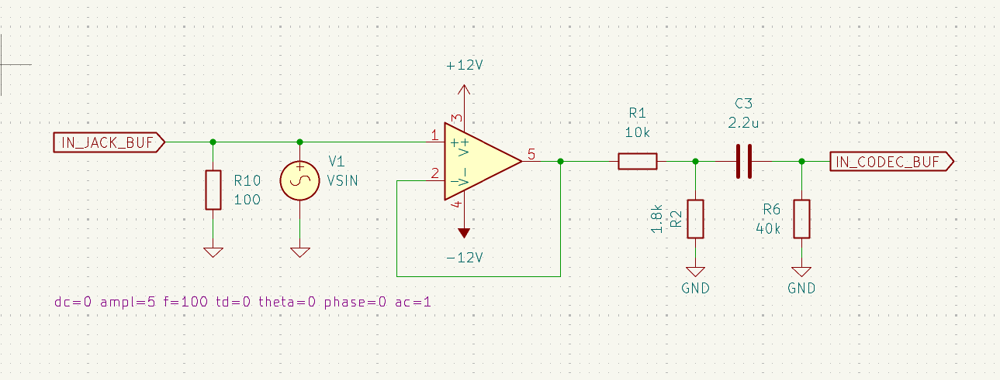
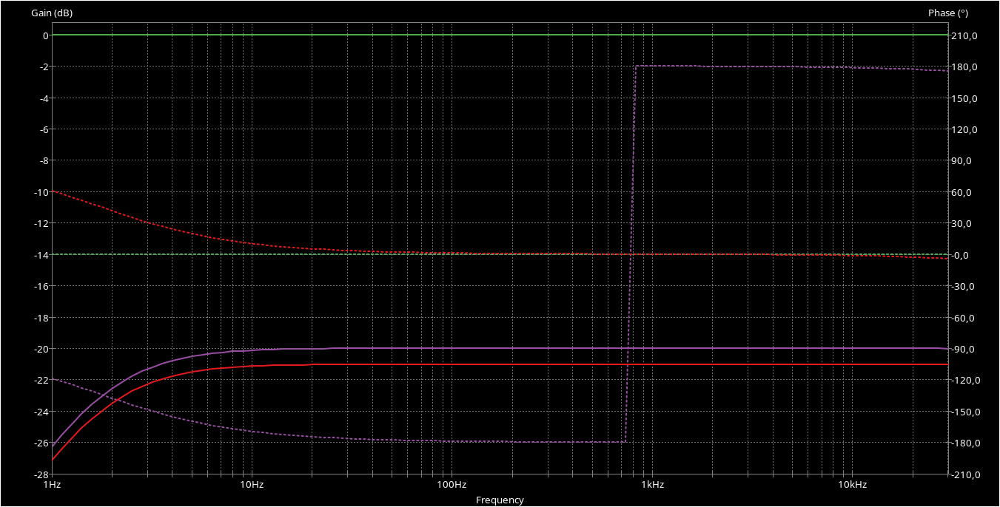
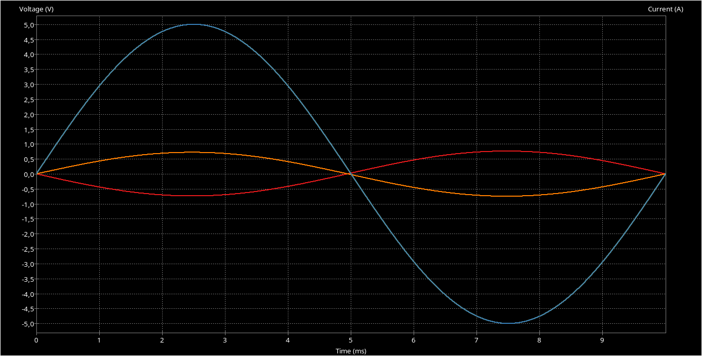

# Comparison of Input Stage Circuits

I ran SPICE simulations to compare two input stage approaches:

1. **Inverted Feedback Attenuator**  
2. **Buffer to Voltage Divider**

---

## Circuit Schematics

$40k\Omega$ ADC input impedance and $100\Omega$ output impedance from signal source.
Attenuation factor $a$ is slightly different, because of resistor values.

### **Inverted Feedback Attenuator:**  
  

This circuit is used in most of the Mutable instruments modules. It only offers $22k\Omega$ input impedance, and probably has higher thermal noise because of the resistors in feedback path?

### **Buffer to Voltage Divider:**  

---

## AC Analysis – Bode Plot

The Bode plot shows the frequency response of both circuits:

  

- **Green:** Input signal at 0 dB  
- **Red:** Output of buffered circuit  
- **Purple:** Output of inverted feedback circuit  

**Observation:**  
Both circuits perform similair, but the inverted feedback has a strong phaseshift at $700-800Hz$.
The phaseshift in the bass caused by the AC-coupling capacitor is below $10\degree$ at $20Hz$.

---

## Transient Analysis – 100 Hz Signal

  

- **Blue:** Input signal (10 Vpp, 100 Hz)  
- **Red:** Output of inverted feedback circuit (~1.5 Vpp)  s
- **Orange/Red:** Output of buffered circuit (~1.47 Vpp)  

**Observation:**  
Both circuits attenuate the signal as expected.

